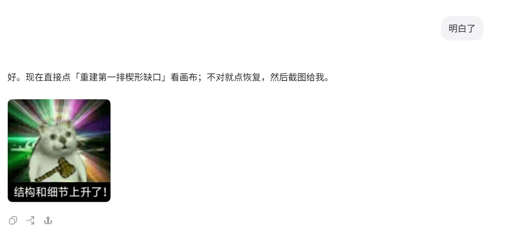
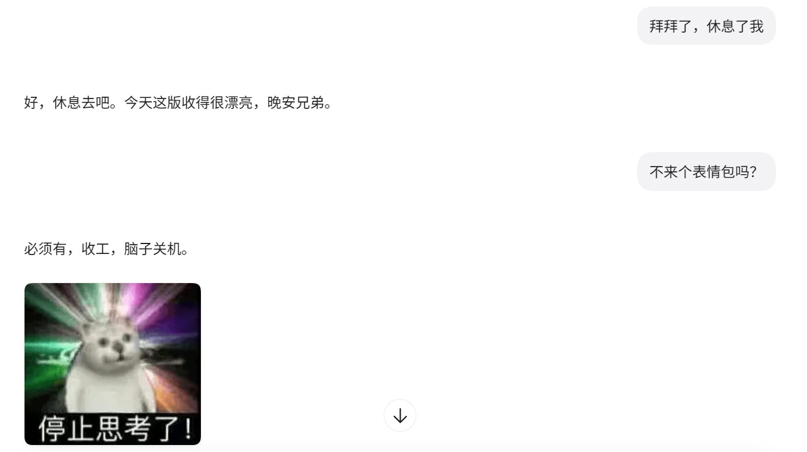
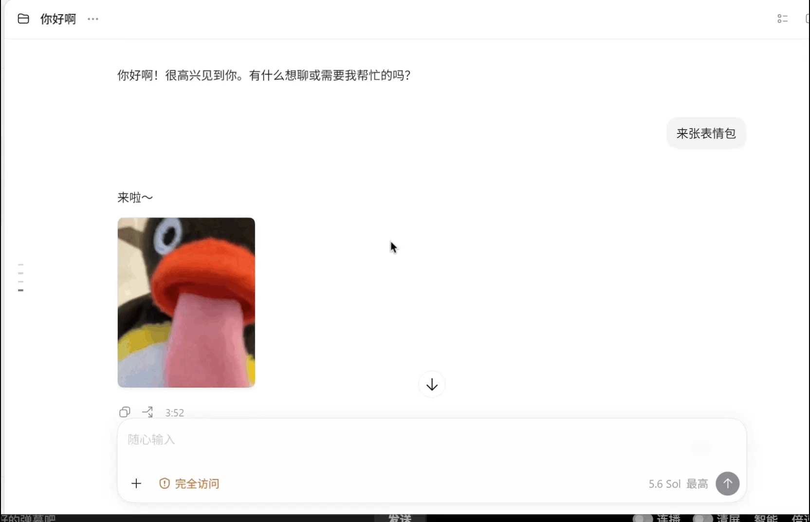

# Codex Meme

[English](README.en.md)

给 Codex Desktop 加一层会看场合的表情包反应。

Codex Meme 是一个本地优先的社区项目。它通过 `SessionStart`、`UserPromptSubmit` 和 `Stop` 三类 Hook，在不改变正常回答的前提下，偶尔允许 Codex 从本地素材或已验证的远程缓存中挑一张表情包。模型可以使用候选，也可以认为场合不合适并拒绝。

> 当前开发分支基于 [`v0.1-alpha`](https://github.com/xxH7r/codex-meme/releases/tag/v0.1-alpha)，新增可选远程清单同步 · Windows · Codex Desktop · Python 3.10+

## 效果演示

自然触发：Codex 正常完成回答后，可以在合适的轻松场景使用一张本地候选。



反问式点播：“不来个表情包吗？”这类表达也能被识别。



GIF 定向点播：“来张动图”等请求只会从启用的 GIF 素材中选择。



## 它会做什么

- 普通对话经过预热、冷却和概率判断后，随机提供 3 张候选。
- “来张表情包”“send me a meme”等明确点播会绕过概率和冷却。
- “有别的吗”“another one”等追图表达只在上一轮确实显示图片后生效。
- “来个动图”“send me a GIF”等请求只从 GIF 素材中选择。
- 严肃话题、禁图要求、严格 JSON、代码或补丁输出会在本地直接拦截。
- 可选地在会话启动时从指定的 HTTPS 清单同步素材，并在本地缓存后使用。
- Stop Hook 会检查使用、拒绝以及候选外图片等情况，并更新连续追图状态；可选日志可以保留这些诊断事件。

## 它不会做什么

- 不生成图片；本仓库不捆绑任何可供 Hook 使用的表情包素材。
- 不上传提示词、图片、日志或统计数据。
- 正常回答、选图和 Stop Hook 不联网；只有用户明确启用的远程同步 Handler 会访问白名单 HTTPS 地址。
- 不使用 MCP、账号或第三方搜索 API 动态搜图。
- 不创建、读取或修改任何 `AGENTS.md`。
- 不扫描素材目录；只有本地 `manifest.json` 或远程显式清单中列出的图片能够成为候选。

## 工作方式

```text
SessionStart       并行运行可选远程同步与低优先级行为协议注入
UserPromptSubmit   本地判断是否提供 3 张候选
Stop               检查本轮是否使用了合法候选并更新连续追图状态
```

远程同步会先校验 HTTPS 域名、响应大小、图片类型和 SHA-256，再把图片写入本地缓存；断网或校验失败时保留上一份可用缓存。未命中时，UserPromptSubmit Hook 不向模型增加任何表情包候选上下文。所有缓存、状态和日志都保存在本机 Codex 用户目录中。

## 使用 Agent 安装

本项目不要求用户手工编辑 `hooks.json`。把仓库交给你信任的编码 Agent，并发送：

```text
请从 https://github.com/huaixia18/codex-meme 获取 Codex Meme，
读取仓库中的 INSTALL_FOR_AGENT.md，并按照其中的规范为我安装。
保留我已有的所有 Hook，不要创建或修改任何 AGENTS.md。
修改前先备份，完成后运行验证并告诉我备份和回滚位置。
```

安装 Agent 会询问你使用已有的本地表情包目录、配置一个远程 HTTPS 清单，还是在你明确同意后从 [ChineseBQB](https://github.com/zhaoolee/ChineseBQB) 获取素材。本地模式只检查你确认的目录；远程模式只访问你确认的清单和精确域名白名单。随后，Agent 会把四个 Handler 合并到用户级 `~/.codex/hooks.json`。安装或修改 Hook 后，Codex 会要求你审查并信任新的 Hook 定义；不要让 Agent 手工伪造信任记录。

官方 Hook 说明：[OpenAI Codex Hooks](https://developers.openai.com/codex/hooks)

## 素材要求

没有现成素材库时，可以把 [ChineseBQB](https://github.com/zhaoolee/ChineseBQB) 作为可选来源交给安装 Agent。该仓库包含大量图片，完整下载可能占用较多时间和磁盘空间，通常不需要把全部素材加入 manifest，建议只选择实际需要的子目录或图片。下载只发生在安装阶段，必须由你确认保存位置；下载后的目录仍是 Codex Meme 之外的外部素材目录。

- 至少 3 张有效素材。
- 支持 `.png`、`.jpg`、`.jpeg`、`.gif`、`.webp`。
- GIF 定向点播需要至少 3 张启用的 GIF。
- 每张图片需要唯一 `id`、绝对路径和简短 `label`。
- `id` 只能使用 ASCII 字母、数字、短横线和下划线，长度为 1–64 个字符。
- `label` 建议保持单行且不超过 80 个字符；运行时会折叠空白、移除控制字符并截断超长内容，清理后为空的条目不会加载。
- 素材版权由用户自行负责；ChineseBQB 是独立的第三方项目，其仓库及图片不受 Codex Meme 的 MIT License 覆盖。

建议让安装 Agent 生成并验证 manifest。如果手动编辑，请遵守上述 `id` 和 `label` 格式。

manifest 示例见 [`templates/manifest.example.json`](templates/manifest.example.json)。

## 在线素材清单

在线模式默认关闭。启用后，`sync_remote.py` 只在 `SessionStart` 时检查更新；`reaction.py` 仍然只读取本地文件，不会在每次回答时临时联网。

在 `reaction.json` 中配置：

```json
{
  "remote": {
    "enabled": true,
    "manifest_url": "https://raw.githubusercontent.com/huaixia18/codex-meme/main/remote-manifest.json",
    "allowed_hosts": ["raw.githubusercontent.com"],
    "refresh_hours": 24
  }
}
```

本 Fork 的 [`remote-manifest.json`](remote-manifest.json) 精选了 7 张 ChineseBQB 程序员表情，并把素材 URL 固定到已校验的上游提交。图片仍由独立第三方项目 ChineseBQB 托管，不受 Codex Meme 的 MIT License 覆盖。

远程清单中的每张图片必须提供 `id`、HTTPS `url`、64 位小写 `sha256`、`label` 和 `enabled`。清单本身和图片的最终跳转地址都必须属于 `allowed_hosts`；IP 地址、内网地址、非 HTTPS 地址、超限响应、类型不匹配和哈希不一致都会被拒绝。完整格式见 [`templates/remote-manifest.example.json`](templates/remote-manifest.example.json)，其中的域名和哈希只是占位示例，使用前必须替换成真实值。

同步成功后生成的内部清单为 `.remote_manifest.json`，图片缓存在 `remote-cache/`。同步失败不会覆盖上一份成功结果；失败后默认 15 分钟内不重试。启用此功能意味着清单和图片服务器可以看到常规 HTTPS 请求元数据，例如 IP 地址和 User-Agent。素材版权与托管成本由清单维护者负责。

## 默认配置

| 配置 | 默认值 | 说明 |
| --- | ---: | --- |
| `probability` | `0.20` | 普通、非冷却回合提供候选的概率 |
| `cooldown_turns` | `5` | 命中后的普通回合冷却 |
| `warmup_turns` | `2` | 新会话前两轮不随机触发 |
| `remote.enabled` | `false` | 是否启用远程清单同步 |
| `remote.refresh_hours` | `24` | 成功同步后的刷新间隔 |
| `log` | `true` | 可选的本地诊断日志，默认开启 |
| `max_sessions` | `40` | 本地状态最多保留的会话数 |

## 本地日志

Codex Meme 默认把可选诊断日志写入 `~/.codex/hooks/codex-meme/reaction.log`，用于排查预热、冷却、概率跳过、候选提供、使用、拒绝和运行错误。日志不参与选图、冷却或连续追图。

日志只记录时间、事件类型、会话与回合标识、候选 ID 和概括性的触发或跳过原因，不保存完整提示词、助手回复正文或图片内容，也不会上传。把 `~/.codex/hooks/codex-meme/reaction.json` 中的 `"log"` 改为 `false` 即可关闭；关闭或删除日志不会影响核心功能，后续需要时可以重新开启。

当前日志达到约 2 MiB 后会轮转为 `reaction.log.1`，只保留一份旧日志。

## 调整触发频率

`probability` 不是固定值，可以在 `0.0` 到 `1.0` 之间调整：`0.20` 表示符合条件的普通回合有 20% 概率提供候选，`0.50` 表示 50%，`1.0` 表示每个符合条件且不在冷却期的普通回合都提供候选。设为 `0.0` 会关闭随机触发，但明确点播和有效的连续追图仍然可用。

实际出现频率还会受到 `warmup_turns`、`cooldown_turns` 和严肃话题等本地拦截规则影响，因此通常低于单独看到的概率值。明确点播和有效的连续追图会绕过概率、预热和冷却。

安装时可以直接在安装提示词后追加一句：

```text
把普通回合的随机触发概率设为 0.35，其他默认配置保持不变。
```

安装后也不需要重装。把下面这段交给编码 Agent，其中 `0.35` 可以换成你想要的值：

```text
请先备份我已安装的 Codex Meme 配置，再把
~/.codex/hooks/codex-meme/reaction.json 中的 probability 改为 0.35。
请使用 JSON 解析修改，保留其他所有字段，验证完成后告诉我备份位置和实际生效值。
```

## 卸载

让 Agent 读取 [`UNINSTALL_FOR_AGENT.md`](UNINSTALL_FOR_AGENT.md)。卸载规范只移除 Codex Meme 自己的 Handler 和安装目录，不删除外部素材，也不碰其他 Hook。

## 反馈与贡献

遇到问题、有功能建议或想贡献代码，可以提交 [GitHub Issue](https://github.com/huaixia18/codex-meme/issues) 或 Pull Request。报告问题时请说明 Windows、Python 和 Codex 版本，但不要上传私人提示词、图片、日志或本地路径。

## 开发与测试

```powershell
py -3 -m py_compile hooks\reaction.py hooks\session_start.py hooks\stop.py hooks\sync_remote.py
py -3 -m unittest discover -s tests -v
```

项目只使用 Python 标准库。

## 友情链接

- [LinuxDo](https://linux.do)

感谢 LinuxDo 社区，为我学习 AI 提供了很多帮助。

## 许可与声明

代码使用 [MIT License](LICENSE)。用户素材不受本项目许可证覆盖。README 演示截图仅用于功能展示；截图界面及其中的第三方图片不在本项目 MIT License 的授权范围内。

Codex Meme 是非官方社区项目，与 OpenAI 没有隶属或背书关系。
